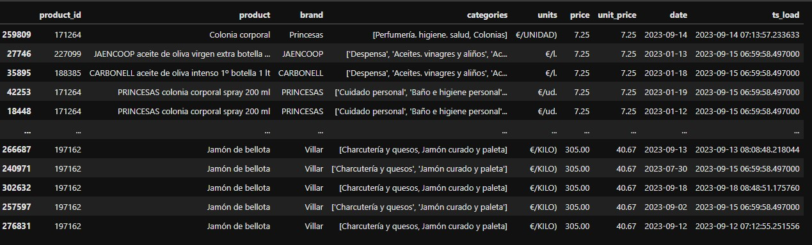

# DATA PRODUCT #

## PRODUCTO_DIA ## 

Almacena los precios de los productos de DIA.es, para cada díay hora de ejecución.

El proceso obtiene la página site.xml de la web, obtiene todos los productos del site
y lanza un proceso de scraping uno a uno. Si algún producto no tiene todos los datos,
no se almacena. Si algún producto falla por conexión, se para la etl.

### Entrada 

- Página web de [DIA](http://www.dia.es).

### Salida

- Tabla: `producto_dia.producto_dim`
- Esquema:
  - **product_id** (string): identificador único del producto en la web de DIA
  - **product** (string): nombre completo del producto
  - brand (string)
  - categories (string)
  - units (string)
  - price (double)
  - unit_price (double)
  - discount (double)
  - date (date)
  - ts_load (timestamp)
- Conexión:
  - Directa por ficheros [Delta Lake](https://delta.io/) 
    - Ruta: `C:\tmp\spark-warehouse`. 
    - Hive metetastore: `C:\tmp\metastore_db`

### Datos

#### Disponibilidad

- La carga de datos se ejecuta a demanda. 

#### Muestra

### Operación 

- El proceso se lanza llamanda al módulo main, con el parámetro obligatorio `reload_urls`:
  - `python -m main --reload_urls True|False`
- Parametros:
  - reload_urls: *True* indica que se escanea completamente la página site.xml y se comienza un
un nuevo proceso de scraping de todos los productos. *False* indica que se continua por
donde se quedara la última ejecución, si es que no terminó.